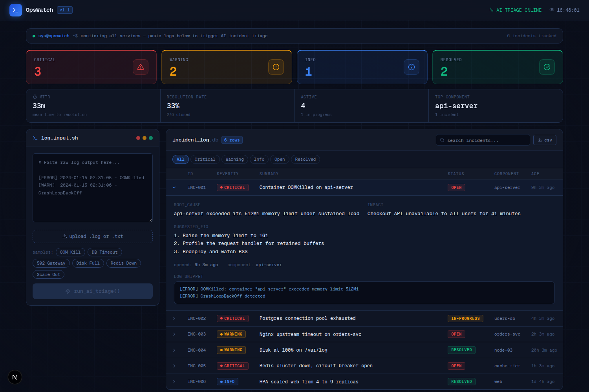

# OpsWatch — AI-Powered DevOps Incident Dashboard

> Paste raw server logs. Get instant AI triage. Track incidents to resolution.

**Live demo → [opswatch-kcgi.vercel.app](https://opswatch-kcgi.vercel.app)**



---

## What is OpsWatch?

OpsWatch is a DevOps incident triage dashboard. Paste raw server logs and an LLM
classifies severity, names the root cause, states the business impact, and returns
numbered remediation steps — then the incident is tracked to resolution with MTTR
reporting.

The workflow it replaces: an on-call engineer reading hundreds of log lines at 2am,
spending 20–30 minutes diagnosing, then searching for a fix. OpsWatch compresses the
triage step to a few seconds.

---

## Features

- **AI triage, streamed** — severity, root cause, impact, remediation steps, and the
  failing component, extracted from raw logs via Groq. Uses the model's Structured
  Outputs mode so the response conforms to a JSON schema rather than being parsed
  heuristically. Results stream over Server-Sent Events and render field by field as
  they arrive, so there is no blank spinner.
- **Recurring-incident detection** — clusters incidents by component and title
  similarity to surface "the same failure has hit api-server 3 times this week",
  and separately flags components failing in several different ways.
- **Model fallback chain** — hosted models get retired regularly. OpsWatch walks a
  chain of models and degrades to the next one instead of going down, and `GROQ_MODEL`
  pins a specific model when needed.
- **Incident lifecycle** — Open → In Progress → Resolved, one click per transition,
  applied optimistically and rolled back if the write fails.
- **Operational metrics** — MTTR, resolution rate, active count, and the most affected
  component, computed from `resolved_at` timestamps.
- **Filtering, search, and CSV export** — filter by severity or status, full-text search
  across title, component, and root cause, and export the filtered view.
- **Log input** — paste directly, upload a `.log`/`.txt` file, or load one of six sample
  failure scenarios.

---

## Tech Stack

| Layer | Technology |
|---|---|
| Framework | Next.js 16 (App Router) + React 19 + TypeScript |
| Styling | Tailwind CSS v4 |
| AI | Groq — LLaMA 3.3 70B, with a fallback chain |
| Database | Supabase (PostgreSQL) |
| Testing | Vitest — 101 tests |
| CI | GitHub Actions — lint, typecheck, test, build |
| Deployment | Vercel |

---

## Architecture

```
Browser (React client components)
  │
  │  POST /api/triage        { logs, stream: true }
  ▼
Route handler
  ├─ rate limit + input validation (20k char cap)
  ├─ resolve a working model BEFORE opening the stream
  ├─ Groq chat completion, Structured Outputs against a JSON schema
  ├─ model fallback chain on a retired-model error
  └─ relay deltas as SSE, then a validated `done` frame
  │
  │  text/event-stream
  ▼
Client accumulates deltas, parses the partial JSON each chunk,
renders whichever fields have fully arrived
  │
  │  POST /api/incidents     { severity, title, root_cause, ... }
  ▼
Route handler (service-role Supabase client)
  └─ incident_no assigned by a Postgres sequence
  │
  ▼
PostgreSQL — RLS on, no anon policy; all access server-side
```

Clients never talk to Supabase directly. Every read and write goes through a route
handler, so row level security can deny anonymous access outright.

---

## Getting Started

### Prerequisites

- Node.js 20.9+ (required by Next.js 16)
- A [Supabase](https://supabase.com) project (free)
- A [Groq](https://console.groq.com) API key (free)

### 1. Clone and install

```bash
git clone https://github.com/pranjalsharma-6/opswatch.git
cd opswatch
npm install
```

### 2. Set up the database

Run [`supabase/migrations/0001_init.sql`](supabase/migrations/0001_init.sql) in the
Supabase SQL editor. It creates the `incidents` table, the incident-number sequence,
indexes, and enables row level security.

Upgrading an existing OpsWatch database instead? Run
[`0002_add_resolved_at.sql`](supabase/migrations/0002_add_resolved_at.sql).

### 3. Configure the environment

```bash
cp .env.example .env.local
```

Then fill in the values:

| Variable | Required | Notes |
|---|---|---|
| `NEXT_PUBLIC_SUPABASE_URL` | yes | Supabase → Project Settings → API |
| `NEXT_PUBLIC_SUPABASE_ANON_KEY` | yes | Same page |
| `SUPABASE_SERVICE_ROLE_KEY` | recommended | Server-only. Bypasses RLS — never expose it to the client |
| `GROQ_API_KEY` | yes | console.groq.com |
| `GROQ_MODEL` | no | Pins one model; otherwise the fallback chain is used |

### 4. Run

```bash
npm run dev
```

Open [http://localhost:3000](http://localhost:3000).

The app starts and builds without any environment variables set — missing configuration
surfaces as an actionable message in the UI rather than a crash.

---

## Scripts

| Command | Description |
|---|---|
| `npm run dev` | Development server |
| `npm run build` | Production build |
| `npm test` | Run the test suite |
| `npm run test:watch` | Tests in watch mode |
| `npm run lint` | ESLint |
| `npm run typecheck` | `tsc --noEmit` |

---

## Testing

101 tests covering log parsing, partial-JSON recovery, SSE framing, pattern
clustering, metrics, rate limiting, and both API route handlers (with the Groq and
Supabase clients mocked).

```bash
npm test
```

The suite includes regression tests for each bug listed below, so they cannot return
silently.

---

## Notable Engineering Decisions

**Clients are constructed lazily, not at module scope.** `new Groq({ apiKey })` throws
when the key is absent. Building it at module scope meant the route module failed to
load, which failed `next build` during page-data collection — the whole app, because one
optional integration was unconfigured. Both the Groq and Supabase clients are now built
inside the request path.

**Structured Outputs instead of repairing JSON by hand.** The model is constrained to a
JSON schema. The earlier approach escaped every newline across the response and unescaped
it after extraction, which converted the model's `\n` escapes into literal newlines inside
JSON string literals — invalid JSON, so every response containing a multi-step fix threw.

**A model chain, not a hardcoded id.** Groq retires hosted models on a rolling basis, and
a retired id returns a 404 that took the feature down until the string was edited by hand.

**Incident numbers come from a Postgres sequence.** They were previously derived in the
browser from the current row count, so two concurrent saves read the same count and
produced duplicate numbers.

**Writes are server-side and RLS denies anonymous access.** The anon key ships to the
browser, so a policy permissive enough for direct client writes is equally open to anyone
reading the page source. Route handlers hold the service-role key instead.

**Streaming resolves the model before opening the stream.** Once an SSE response is
committed it is already a 200, so a later failure can only be reported in-band. The
model fallback chain therefore runs first, and auth, rate-limit and retired-model
errors still surface as real HTTP status codes. Only a mid-stream drop becomes an
in-band `error` frame.

**Partial JSON is repaired, not guessed.** A streamed response is not valid JSON until
the final brace, so each chunk is parsed by closing the open string and containers and
discarding a dangling key. Fields render as they complete. The client never treats its
own partial parse as final — the terminating `done` frame carries the server-validated
result.

**Pattern clustering uses token similarity, not exact matching.** AI-written titles for
one failure mode share their distinctive nouns but vary in phrasing, so exact signature
matching grouped almost nothing. Titles are tokenised, stemmed, and compared by Jaccard
index above a tuned threshold.

**Rate limiting is in-memory and per-instance.** It stops one client from trivially
draining the Groq quota. On serverless each instance carries its own counter, so the
effective global limit is higher than configured — a durable store (Redis, Postgres) is
the next step.

---

## Sample Log Scenarios

| Scenario | Severity | Signature |
|---|---|---|
| Kubernetes OOM kill | Critical | Container over memory limit, CrashLoopBackOff |
| Database connection exhaustion | Critical | PostgreSQL `max_connections` exceeded |
| Redis cache failure | Critical | `CLUSTERDOWN`, circuit breaker open |
| 502 Bad Gateway | Warning | Nginx upstream timeout, ImagePullBackOff |
| Disk space critical | Warning | `/var/log` at 100%, MySQL write failures |
| Auto-scaling event | Info | HPA scale-out on a traffic spike |

---

## Deployment

1. Push to GitHub.
2. Import the project on [Vercel](https://vercel.com).
3. Add the environment variables from the table above.
4. Deploy.

---

## Roadmap

- Slack notifications on critical incidents
- Webhook ingestion from Datadog, PagerDuty, and Grafana
- Multi-user support with per-engineer assignment
- Durable rate limiting backed by Redis

---

## Author

**Pranjal Sharma** — B.Tech Electronics and Computer Science, KIIT University

[GitHub](https://github.com/pranjalsharma-6)

---

## License

MIT
